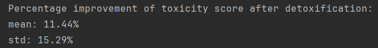

# Dialogue Summarization and Detoxification

## Overview

This repository contains the implementation of an advanced dialogue summarization system using the FLAN-T5 model, which has been fine-tuned with Parameter-Efficient Fine-Tuning (PEFT) techniques like Low-Rank Adapters (LoRA) and optimized further through Reinforcement Learning (RL) with Proximal Policy Optimization (PPO) for detoxification.

## Features

- **FLAN-T5 Model**: Leveraging few-shot learning capabilities for accurate dialogue summarization.
- **PEFT/LoRA**: Parameter-efficient training preserving the base model's integrity.
- **RL & PPO**: Detoxification process integrated to ensure safe and reliable content generation.

## Results

The detoxification process has been quantified, and the model shows a significant reduction in toxicity scores post-optimization, as detailed below:

- **Mean toxicity score reduction**: 11.44%
- **Standard deviation reduction in toxicity**: 15.29%



## Setup and Training

- Clone the repository and install the required packages from `requirements.txt`.
- Pre-train the FLAN-T5 model with dialogue datasets using PEFT/LoRA.
- Optimize the summarization model using RL with PPO based on the toxicity scores.

## Usage

Instructions for running the summarization and detoxification model:

```bash
python main.py
