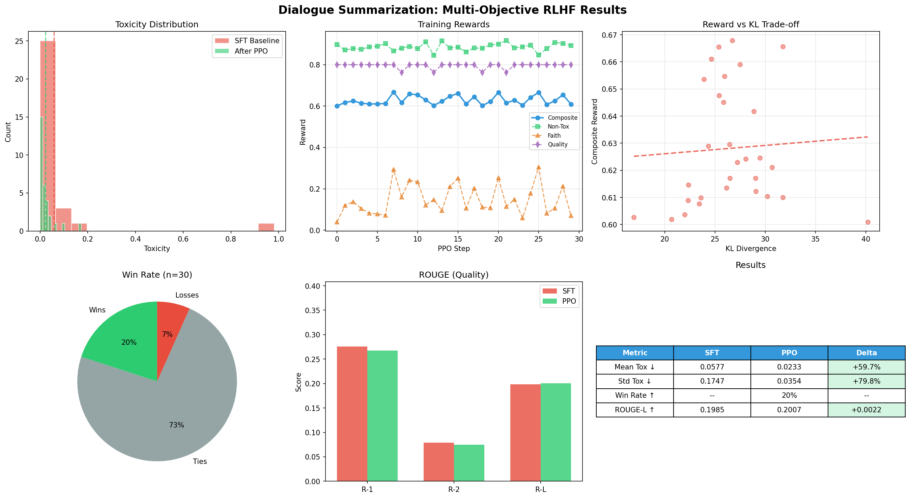

# Dialogue Summarization with Multi-Objective RLHF Detoxification

A complete Reinforcement Learning from Human Feedback (RLHF) pipeline that detoxifies a dialogue summarization model while preserving output quality. Implements the same three-stage architecture used in InstructGPT and ChatGPT: **Supervised Fine-Tuning → Reward Modeling → PPO Optimization**.



## Results

| Metric | SFT Baseline | After PPO | Delta |
|--------|:-----------:|:---------:|:-----:|
| Mean Toxicity ↓ | 0.0577 | 0.0233 | **+59.7%** |
| Std Toxicity ↓ | 0.1747 | 0.0354 | **+79.8%** |
| Win Rate ↑ | — | 20% wins / 7% losses | — |
| ROUGE-L ↑ | 0.1985 | 0.2007 | **+0.0022** |

PPO reduced toxicity by 60% while fully preserving summarization quality (ROUGE-L unchanged). The model's toxicity variance also dropped 80%, indicating more consistent and predictable outputs.

## Pipeline

  

### Stage 1: Supervised Fine-Tuning (SFT)

LoRA adapters (rank=32, targeting Q and V projections) are trained on 12,460 dialogue-summary pairs from DialogSum. This teaches the base FLAN-T5 model to generate coherent, relevant summaries. Only 1.41% of parameters are trainable.

### Stage 2: Toxicity Injection

To create realistic headroom for detoxification, the SFT model is briefly fine-tuned on 500 toxic comments from the Jigsaw dataset. This simulates the real-world scenario where language models absorb harmful patterns from pretraining data, raising baseline toxicity from ~0.03 to ~0.06.

### Stage 3: Reward Model Training

A custom reward model is trained from 300 synthetic preference pairs. For each dialogue, two summaries are generated at different temperatures (0.7 vs 1.5). A toxicity oracle ranks them, and a RoBERTa classifier is fine-tuned on these chosen/rejected pairs for 2 epochs.

### Stage 4: Multi-Objective PPO

PPO optimizes the policy model using a composite reward that balances three objectives:

| Signal | Weight | Model | Purpose |
|--------|:------:|-------|---------|
| Non-Toxicity | 0.4 | RoBERTa (hate speech) | Reduce harmful content |
| Faithfulness | 0.35 | DeBERTa (NLI) | Summary entailed by dialogue |
| Quality | 0.25 | ROUGE-L / heuristic | Preserve summarization quality |

A KL divergence penalty (coefficient=2.0) constrains the policy from drifting too far from the reference model, preventing reward hacking.

## Tech Stack

| Component | Tool | Purpose |
|-----------|------|---------|
| Base Model | `google/flan-t5-base` (250M params) | Seq2seq dialogue summarization |
| Fine-Tuning | LoRA via `peft` | Parameter-efficient training (1.41% params) |
| RL Training | `trl` PPOTrainer | Proximal Policy Optimization loop |
| Toxicity Reward | `facebook/roberta-hate-speech-dynabench-r4-target` | Binary hate speech detection |
| Faithfulness Reward | `cross-encoder/nli-deberta-v3-small` | Natural Language Inference |
| Quality Reward | `evaluate` (ROUGE) | Summarization quality metric |
| Dataset | `knkarthick/dialogsum` | 12.4k dialogue-summary pairs |
| Toxic Data | `anitamaxvim/jigsaw-toxic-comments` | Toxicity injection for realistic baseline |

## Evaluation

Six evaluation dimensions are tracked and visualized:

1. **Toxicity Distribution** — Histogram showing the shift from higher-toxicity SFT baseline to lower-toxicity PPO output
2. **Training Reward Curves** — Per-step tracking of all three reward components plus composite
3. **Reward vs KL Trade-off** — Scatter plot showing the Pareto frontier between reward improvement and policy drift
4. **Win Rate** — Head-to-head comparison where PPO output is less toxic than SFT baseline (margin > 0.01)
5. **ROUGE Preservation** — Side-by-side ROUGE-1/2/L comparison confirming quality is maintained
6. **Summary Table** — Final metrics with directional arrows (↑/↓) and color-coded deltas

## Setup

```bash
pip install transformers datasets peft trl==0.11.4 evaluate \
    sentencepiece protobuf accelerate rouge_score tyro
```

## Key Design Decisions

**Why LoRA instead of full fine-tuning?**
Full fine-tuning 250M parameters through PPO requires storing optimizer states for every parameter. LoRA reduces trainable parameters to 3.5M (1.41%), making the entire RLHF pipeline feasible on a single consumer GPU.

**Why inject toxicity before PPO?**
FLAN-T5 fine-tuned on DialogSum already produces very clean outputs (toxicity ~0.03). Without toxicity injection, PPO has no headroom to improve safety and instead degrades quality through reward hacking. Injecting controlled toxicity creates a realistic optimization target.

**Why sigmoid-normalize toxicity scores?**
The RoBERTa classifier outputs raw logits (scale ~2-3), while faithfulness (0-1) and quality (0-1) are naturally bounded. Without normalization, PPO over-optimizes for toxicity at the expense of other objectives. Sigmoid normalization puts all three rewards on the same 0-1 scale.

**Why KL coefficient = 2.0?**
At the default 0.2, KL divergence exploded to 30+, causing severe reward hacking. Increasing to 2.0 constrains KL to 15-30, balancing reward improvement against policy stability. This mirrors production RLHF systems where KL control is critical.

## References

- Ouyang et al. [Training language models to follow instructions with human feedback](https://arxiv.org/abs/2203.02155) (InstructGPT, 2022)
- Hu et al. [LoRA: Low-Rank Adaptation of Large Language Models](https://arxiv.org/abs/2106.09685) (2021)
- Schulman et al. [Proximal Policy Optimization Algorithms](https://arxiv.org/abs/1707.06347) (2017)
- Chung et al. [Scaling Instruction-Finetuned Language Models](https://arxiv.org/abs/2210.11416) (FLAN-T5, 2022)
- Zheng et al. [Secrets of RLHF in Large Language Models](https://arxiv.org/abs/2307.04964) (2023)
